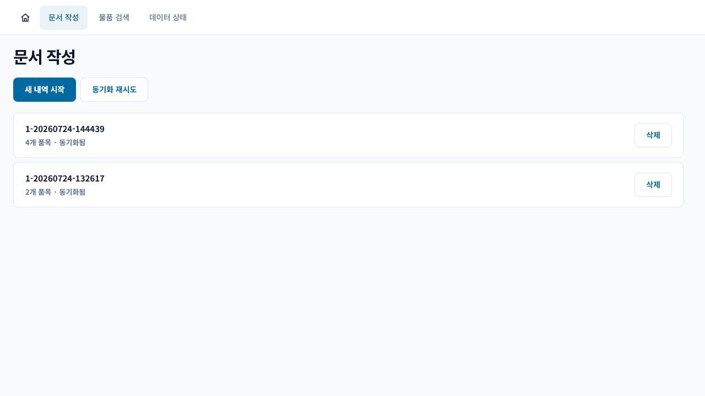
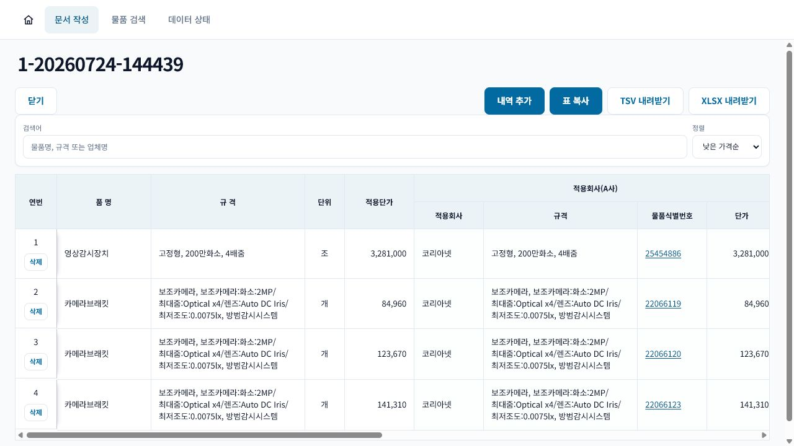
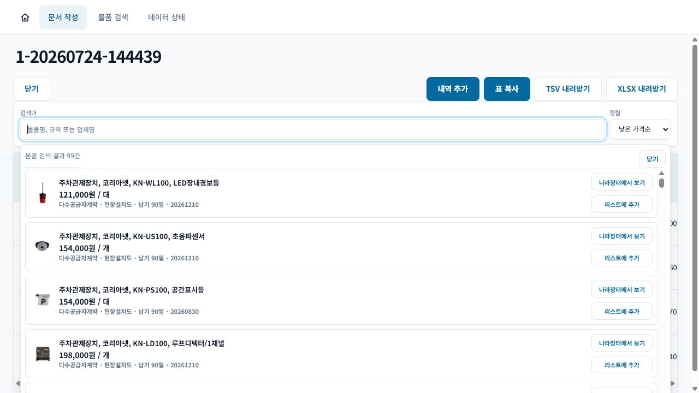
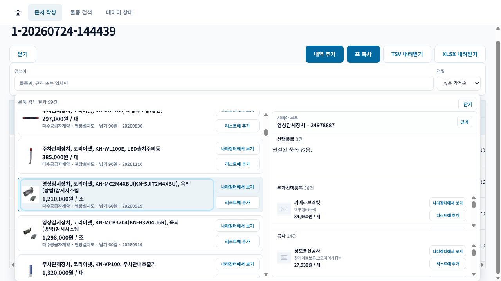

# G2B Compare 문서 작성 매뉴얼

작성일: 2026-07-27
대상: G2B Compare를 이용해 단가조사 문서를 작성하는 사용자

## 빠른 순서

1. 상단의 `문서 작성` 탭을 연다.
2. `새 내역 시작`을 누르거나 저장된 문서를 선택한다.
3. 검색창에서 코리아넷 본품을 찾는다.
4. 본품 또는 연결된 선택품목, 추가선택품목, 공사를 `리스트에 추가`한다.
5. 표에서 품명, 규격, 적용단가와 A/B/C사 비교 내용을 확인한다.
6. 필요하면 행을 삭제하고 `표 복사` 또는 `XLSX 내려받기`를 사용한다.

> 빈 문서를 따로 관리할 필요 없이 품목을 추가하면서 문서를 작성하면 된다. 작업 중인 문서는 문서 목록에서 다시 열 수 있다.

> 참고: 현재 자동 추천 및 대조군 선정 로직은 보완 중이어서 검색 조건이나 데이터 상태에 따라 원하는 품목과 다른 결과가 표시될 수 있다. 문서에 추가한 뒤 규격, 단가, 업체를 반드시 확인한다.

## 1. 문서 시작 또는 다시 열기

상단 메뉴에서 `문서 작성`을 선택한다.

- 새 문서를 만들 때는 `새 내역 시작`을 누른다.
- 기존 작업을 계속할 때는 문서 제목이 표시된 행을 누른다.
- 목록에는 품목 수와 동기화 상태가 함께 표시된다.
- 더 이상 필요하지 않은 문서는 오른쪽의 `삭제`로 제거한다.

## 2. 문서 편집 화면 확인

문서를 열면 상단에 문서 제목과 작업 버튼, 가운데에 검색창, 아래에 단가조사 표가 표시된다.

- 제목을 누르면 문서명을 수정할 수 있다.
- 표에는 품명, 규격, 단위, 적용단가와 A/B/C사 비교 정보가 표시된다.
- 규격 셀에 마우스를 올리면 전체 규격을 확인할 수 있다.
- 물품식별번호를 누르면 해당 나라장터 상세 화면으로 이동한다.

## 3. 본품 검색 및 추가

검색창을 누르면 코리아넷 본품 목록이 열린다. 품명, 규격 또는 물품식별번호로 검색할 수 있다.

1. 검색어를 입력한다.
2. 필요하면 정렬 기준을 변경한다.
3. 원하는 품목의 가격과 규격을 확인한다.
4. `리스트에 추가`를 누르면 문서 표에 행이 추가된다.
5. 원본 정보가 필요하면 `나라장터에서 보기`를 누른다.

## 4. 선택품목, 추가선택품목, 공사 추가

본품 카드 자체를 누르면 오른쪽에 해당 본품과 연결된 품목이 표시된다.

- `선택품목`: 본품 구성에 포함되는 선택 품목
- `추가선택품목`: 필요에 따라 추가하는 장비와 자재
- `공사`: 설치, 시험, 포장 등 연결된 공사 항목

원하는 하위 품목의 `리스트에 추가`를 누르면 본품과의 연결 정보가 유지된 채 문서 행으로 들어간다. 연결 항목이 많으면 각 영역을 스크롤해 확인한다.

## 5. 표 검토와 행 관리

품목을 추가한 뒤 다음 항목을 순서대로 확인한다.

1. 품명과 축약 규격이 의도한 항목인지 확인한다.
2. 단위와 적용단가를 확인한다.
3. A사는 코리아넷 기준 품목인지 확인한다.
4. B사와 C사의 회사명, 규격, 식별번호, 단가를 확인한다.
5. 잘못 추가한 행은 연번 아래의 `삭제`로 제거한다.

비교군은 자동으로 표시되므로 금액과 규격이 적절한지만 확인하면 된다. 규격이 축약되어 있으면 해당 셀에 마우스를 올려 전체 내용을 확인한다.

## 6. 복사와 내보내기

- `표 복사`: 문서 표의 데이터 열을 복사한다. Excel에서 원하는 시작 셀을 선택한 뒤 붙여넣는다.
- `TSV 내려받기`: 표 내용을 탭으로 구분한 텍스트 파일로 저장한다.
- `XLSX 내려받기`: 문서 내용을 Excel 통합문서로 저장한다.
- `닫기`: 문서 목록으로 돌아간다.

`표 복사`에는 화면 조작용 연번과 삭제 버튼이 포함되지 않는다.

## 완료 전 확인

- 품목과 규격이 맞는가?
- 수량 또는 단가를 추가로 확인해야 하는가?
- A/B/C사가 의도한 비교군인가?
- 불필요한 행이 남아 있지 않은가?
- Excel 붙여넣기 또는 XLSX 파일이 정상적으로 열리는가?
