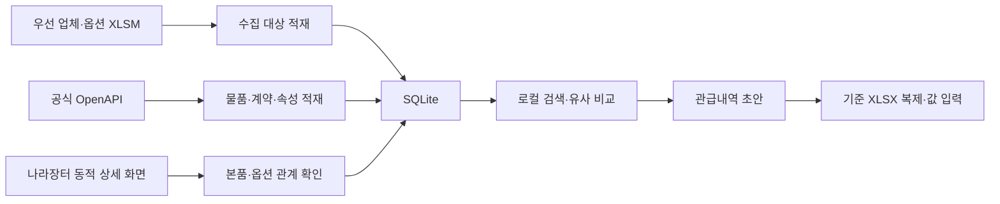

# 나라장터 물품 비교·관급내역서 작성 MVP 구현 인수인계

작성일: 2026-07-21  
대상 저장소: `02_automation1`  
문서 목적: 다음 구현자가 별도 기획 없이 현재 코드에 이어서 통합 MVP를 완성할 수 있게 함

## 1. 결론

가능함. 다만 “현재 엑셀과 정확히 같은 스타일”은 새 워크북을 비슷하게 그리는 방식이 아님.

기준 파일을 통째로 복사한 뒤, 지정된 입력 셀과 이미지 자리만 바꿔 새 `.xlsx`로 저장해야 함. 이 방식이면 다음 항목을 그대로 유지할 수 있음.

- 20개 시트와 시트 순서
- 병합 셀, 행 높이, 열 너비, 테두리, 글꼴, 색상, 숫자 형식
- 수량산출서 → 단가조사 → 관급내역서 → 조달물품으로 이어지는 수식
- 인쇄 영역, 용지 방향, 여백, 페이지 나누기
- 조달물품 시트의 이미지 배치 위치

여기서 “정확히 같다”는 화면·인쇄 서식과 워크북 구조가 같다는 뜻임. 파일 내부 ZIP 바이트까지 동일하다는 뜻은 아님. 물품명, 가격, 수량, 업체, 이미지 같은 실제 내용은 선택 데이터에 맞게 바뀜.

기준 파일의 관급 품목 입력 구간은 9행임. 서식 훼손 없이 완성하는 MVP는 내역을 최대 9개로 제한함. 10개 이상을 자동으로 늘리려면 수식, 이미지 배치, 페이지 나누기 규칙부터 추가 합의해야 하므로 이번 범위에 넣지 않음.

## 2. 최종 MVP 한 문장

공식 API와 나라장터 상세 화면에서 수집해 로컬 SQLite에 저장한 물품·스펙·본품/옵션 관계를 빠르게 검색하고, 본품과 유사 물품 2개를 비교해 최대 9개 관급 품목을 편집한 뒤 기준 서식 그대로 Excel로 내려받는 로컬 웹 앱임.

## 3. 확정 범위

### 포함함

- Windows 데스크톱에서 브라우저로 사용하는 로컬 FastAPI 웹 앱
- 공공데이터포털 인증키 1개 사용
- 우선 업체·옵션 기준 엑셀 가져오기
- 공식 API를 통한 물품, 계약, 가격, 이미지 URL, 원문 JSON, 개별 속성 수집
- Playwright를 통한 나라장터 동적 상세 화면의 본품 → 추가선택품목 관계 수집
- 수집 작업 중단·재개와 진행 상태 표시
- 최신 계약 우선의 로컬 검색
- 품명, 카테고리, 규격·옵션 텍스트 검색
- 한 페이지 30건과 이전/다음 페이지
- 검색 결과에 가격, 업체, 계약, 납품, 스펙, 이미지, 본품/옵션 경로 표시
- 각 기준 물품별 유사 물품 3개 슬롯 중 기준 물품 1개 + 비교 물품 2개 구성
- 관급내역 초안 저장, 수정, 삭제, 순서 변경
- 기준 Excel 전체를 복제한 `.xlsx` 출력
- 데이터 관리 화면에서 수동 동기화, 상태, 카테고리별 적재 건수 확인
- Windows 작업 스케줄러를 이용한 주기 갱신 명령 제공

### 포함하지 않음

- 자동발주
- 나라장터 로그인 자동화
- 장바구니 담기, 주문, 계약, 제출, 결제
- 나라장터에 데이터 쓰기
- 클라우드 배포와 다중 사용자 권한
- 모바일 전용 UI
- 임베딩, LLM, 벡터 데이터베이스
- 검색할 때마다 전체 API를 다시 호출하는 구조
- 기준 서식의 9개 내역을 초과하는 자동 페이지 확장
- 공식 API로 확인할 수 없는 판매량·평점 정렬 흉내

## 4. 기준 파일

### 제품·옵션 우선 수집 기준

`dataset/우수조달물품 업체소재별현황 및 우수옵션(260629).xlsm`

- `업체소재별현황`: 우선 수집할 55개 업체
- `우수옵션`: 원본 14,314행, 고유 물품식별번호 5,404개
- 이 파일의 옵션 행은 수집 대상 목록임
- 이 파일만으로 본품과 옵션의 실제 연결 관계를 확정하면 안 됨
- 같은 물품식별번호가 여러 행, 여러 업체 문맥, 여러 가격으로 나타날 수 있으므로 원본 행을 삭제하거나 하나로 합치면 안 됨

### Excel 출력 기준

`dataset/순천 향교 CCTV 구매 설치 - 내역서(관급)(0706수정).xlsx`

확인된 구조는 다음과 같음.

- 총 20개 시트
- `관급내역서`: `A1:V21`, 실제 품목 행 `5:13`
- `수량산출서`: 실제 품목 행 `8:16`
- `단가조사`: 실제 비교 행 `5:13`
- `조달물품`: 9개 품목 블록, 기준 물품·비교1·비교2 영역
- `조달물품`에 이미지 배치 23개가 존재함
- 해당 이미지는 단순 제품 사진보다 나라장터 옵션 선택 내용을 보여주는 캡처가 주를 이룸

기준 파일은 절대 덮어쓰지 않음. 앱은 버전이 고정된 템플릿 복사본을 사용하고 결과를 별도 파일로 생성해야 함.

## 5. 현재 저장소 상태

### 이미 구현된 부분

| 기능 | 현재 위치 | 상태 |
|---|---|---|
| 메인 FastAPI 앱 | `src/g2b_compare/web/app.py` | 존재함 |
| 로컬 릴리스 검색 | `src/g2b_compare/web/routes.py` | 존재함 |
| 실시간 API 검색 | `src/g2b_compare/web/live_routes.py` | 존재함 |
| 수동 동기화 화면 | `src/g2b_compare/web/sync_routes.py` | 존재함 |
| 규격·가격 기반 비교 3개 | `src/g2b_compare/services/`, `ranking/` | 존재함 |
| 스펙 정확 필터와 facet | 검색 서비스와 템플릿 | 존재함 |
| 30건 페이지 이동 | 메인 검색과 우선수집 목록 | 존재함 |
| 우선 업체·옵션 엑셀 가져오기 | `priority_workbook.py` | 존재함 |
| 회사별 API 수집과 재개 | `priority_api.py`, `priority_store.py` | 존재함 |
| 동적 상세 화면 옵션 수집 | `priority_site.py` | 기본 동작 존재함 |
| 본품 → 옵션 표시 문자열 | `priority_lines.py` | 존재함 |
| 샘플 4건 목록 UI | `web/mvp_app.py`, `mvp_products.json` | 임시 구현임 |
| 관급내역 작성 화면 | 없음 | 구현 필요 |
| Excel 템플릿 출력 | 없음 | 구현 필요 |

### 현재 실제 우선수집 DB 상태

`uv run --no-sync python -m g2b_compare.priority_cli status` 결과 기준임.

```json
{
  "company_count": 55,
  "option_row_count": 14314,
  "unique_option_count": 5404,
  "product_count": 0,
  "relation_count": 0,
  "pending_api_target_count": 162,
  "pending_site_product_count": 0
}
```

업체와 옵션 원본만 들어가 있고 공식 API 물품과 실제 본품/옵션 연결은 아직 적재되지 않은 상태임. 현재 화면에 보이는 샘플 4건을 실제 수집 완료로 착각하면 안 됨.

### 반드시 정리할 현재 문제

1. 실행 앱이 둘로 갈라져 있음
   - 메인 앱: 8765 포트, 로컬 릴리스·실시간·동기화 제공
   - 임시 MVP 앱: 8001 포트, 샘플 4건과 우선수집 표 제공
   - 최종 MVP는 8765 메인 앱 하나로 합쳐야 함

2. `mvp_app.py`는 시작할 때 샘플 테이블을 전부 지우고 다시 넣음
   - 운영 데이터 저장소로 사용하면 안 됨
   - 통합 뒤 이 초기화 경로를 제거해야 함

3. 현재 `priority_product_options`의 기본키는 `(parent_product_id, option_product_id)`임
   - 동일 옵션이 같은 본품의 다른 계약 문맥이나 표시 순서에 존재할 경우 충돌 가능함
   - 옵션 가격이 본품 문맥마다 다를 수 있으므로 관계 자체를 독립 식별해야 함

4. 현재 관계 테이블에 자기 자신 연결 금지 제약이 없음
   - `parent_product_id = option_product_id`는 저장 전에 거부해야 함

5. 현재 본품 상세 링크는 일부 MAS 계약만 계산 가능함
   - 안정적인 계약 키가 없는 행은 임의 링크를 만들면 안 됨
   - 물품 ID 검색으로 실제 상세 페이지를 확인해 얻은 URL만 저장해야 함

6. 현재 검색 결과의 제목이 나라장터 링크인 화면이 있음
   - 제목은 일반 텍스트로 둠
   - `나라장터에서 보기` 버튼만 새 탭 링크로 동작해야 함

7. `priority` 목록의 원본 미연결 옵션은 실제 본품에 연결된 것처럼 보이면 안 됨
   - `미연결 옵션 후보` 상태로 분리해야 함

## 6. 목표 사용자 흐름

1. 사용자가 `scripts/start.py` 한 명령으로 앱을 실행함
2. 브라우저에서 데이터 관리 화면을 열어 우선수집 엑셀을 가져옴
3. `물품 API 동기화`를 실행함
4. 완료된 물품에 대해 `본품/옵션 관계 확인`을 실행함
5. 검색 화면에서 `영상감시장치`, `800만화소`처럼 검색함
6. 최신 유효 계약의 결과를 30개씩 확인함
7. 결과 한 행에서 모든 주요 스펙, 가격, 업체, 계약 종료일, 본품/옵션 경로를 확인함
8. 필요하면 `비슷한 물품 2개`를 펼쳐 비교함
9. 기준 물품이나 검증된 옵션을 관급내역 초안에 추가함
10. 수량과 비교 A사/B사/C사를 확인하고 필요한 항목을 바꿈
11. 최대 9개 품목을 구성함
12. `Excel 내보내기`를 누름
13. 기준 파일과 같은 시트·서식의 새 Excel 파일을 내려받음

## 7. 통합 구조



### 단일 실행 원칙

- 최종 서버는 `src/g2b_compare/web/app.py` 하나만 사용함
- 기본 포트는 `127.0.0.1:8765`임
- `scripts/start.py`가 유일한 일반 실행 진입점임
- `scripts/mvp.ps1`은 통합 후 제거하거나 `scripts/start.py`를 호출하는 얇은 호환 래퍼로 바꿈
- 검색 중에는 로컬 SQLite만 읽음
- API와 브라우저 수집은 데이터 관리 화면 또는 CLI에서 명시적으로 실행함
- 실시간 검색은 진단용 보조 기능으로 남길 수 있으나 첫 화면으로 사용하지 않음

## 8. 데이터 모델

### 8.1 MVP의 실제 검색 데이터

현재 메인 릴리스 계층은 기능은 많지만 전체 릴리스가 준비되기 전에는 `/` 검색을 503으로 막음. 실제 우선수집 물품은 아직 0건이므로 이 계층을 완성할 때까지 기다리면 MVP가 동작하지 않음.

따라서 MVP의 짧은 경로는 다음으로 고정함.

- `priority_companies`: 수집 대상 업체
- `priority_options`: 우선 옵션 원본 행
- `priority_products`: API로 수집한 물품 기본 정보
- `priority_product_offers`: 새로 추가할 계약·가격 문맥
- `priority_product_attributes`: 새로 추가할 물품별 개별 속성 원문
- `verified_product_options`: 새로 추가할 본품·옵션 관계
- `priority_product_search`: 새로 추가할 FTS5 검색 인덱스

`priority_products`와 속성·관계 테이블을 MVP의 로컬 운영 카탈로그로 사용함. `WebPrioritySearchReader`가 이 테이블을 기존 검색·비교 서비스가 읽는 형식으로 변환함. 이 방식이면 이미 구현된 스펙 파서와 비교 랭커는 재사용하면서 전체 과거 카탈로그 릴리스 완료를 기다리지 않아도 됨.

기존 `products`, `catalog_offers`, `product_attributes`, `active_release`와 릴리스 빌드 코드는 삭제하거나 개편하지 않음. 이번 MVP의 필수 실행 경로에서만 제외함. 이후 전체 카탈로그가 준비되면 별도 작업으로 데이터 공급자를 교체할 수 있음.

`priority_product_attributes`의 최소 컬럼은 `product_id`, `attribute_key`, `ordinal`, `raw_name`, `raw_value`, `canonical_value`, `canonical_unit`, `observed_at`임. 기본키는 `(product_id, attribute_key, ordinal)`로 함.

현재 `priority_products`는 `product_id`가 기본키인데 계약 정보까지 같은 행에 넣어 여러 오퍼를 덮어쓸 수 있음. `0004_estimate_mvp.sql`에서 `priority_product_offers`를 추가하고 이후 수집은 물품과 오퍼를 나눠 저장함.

| 컬럼 | 의미 |
|---|---|
| `operation` | API operation |
| `offer_key` | 계약번호와 계약순번으로 만든 안정 키 |
| `product_id` | 물품식별번호 |
| `company_name` | 계약업체 |
| `price_won` | 계약단가 |
| `unit` | 단위 |
| `contract_method` | 계약방법 |
| `delivery_condition` | 인도조건 |
| `delivery_days` | 납품기한 |
| `contract_end_date` | 계약종료일 |
| `image_url` | 제품 이미지 URL |
| `detail_url` | 확인된 상세 URL |
| `raw_json` | 해당 오퍼 원문 JSON |
| `observed_at` | 마지막 관측 시각 |
| `active` | 현재 활성 여부 |

기본키는 `(operation, offer_key)`로 함. `priority_products`에는 카테고리, 품명, 규격처럼 물품 자체의 최신 기본 정보만 둠. 현재 실제 상품 행이 0건이라 복잡한 데이터 이전은 필요 없고 새 수집부터 분리 저장하면 됨.

### 8.2 새로 필요한 관계 테이블

기존 `priority_product_options`를 최종 정본으로 사용하지 말고 다음 구조의 `verified_product_options`를 migration `0004_estimate_mvp.sql`에 추가함.

| 컬럼 | 형식 | 의미 |
|---|---|---|
| `relation_id` | TEXT PK | 관계 문맥 전체의 SHA-256 |
| `parent_operation` | TEXT | 본품 오퍼를 만든 API operation |
| `parent_offer_key` | TEXT | 본품 계약·오퍼 식별자 |
| `parent_product_id` | TEXT | 본품 물품식별번호 |
| `option_product_id` | TEXT | 옵션 물품식별번호 |
| `relation_kind` | TEXT | `additional` 또는 `component` |
| `position` | INTEGER | 상세 화면의 옵션 순서 |
| `company_name` | TEXT | 해당 관계를 제공한 계약 업체 |
| `raw_label` | TEXT | 선택 상자에 표시된 원문 전체 |
| `relation_price_won` | INTEGER | 해당 본품 문맥에서 표시된 옵션 가격 |
| `detail_url` | TEXT | 관계를 확인한 실제 상세 URL |
| `observed_at` | TEXT | 확인 시각 UTC |
| `active` | INTEGER | 마지막 확인 시 존재했는지 여부 |

필수 제약은 다음과 같음.

```sql
CHECK (parent_product_id <> option_product_id)
CHECK (length(parent_product_id) = 8)
CHECK (length(option_product_id) = 8)
UNIQUE (parent_operation, parent_offer_key, relation_kind, position)
```

`relation_id`는 다음 값을 직렬화해 SHA-256으로 만듦.

```text
parent_operation | parent_offer_key | parent_product_id | option_product_id | relation_kind | position | raw_label
```

따라서 같은 옵션 번호가 여러 본품에 달려도 문제없고, 같은 본품의 서로 다른 계약에도 따로 저장됨.

### 8.3 가격 선택 규칙

- 본품 가격: 선택한 `priority_product_offers`의 현재 계약단가
- 옵션 가격: `verified_product_options.relation_price_won`
- 우선수집 엑셀의 `priority_options.price_won`: 수집 힌트와 대조용
- 옵션 관계 가격이 있으면 전역 옵션 가격으로 덮어쓰지 않음
- 관계 가격이 0원이거나 누락되면 UI에 `가격 확인 필요`를 표시하고 Excel 적용단가로 자동 채택하지 않음

같은 옵션 `25560063`이 서로 다른 본품 문맥에서 다른 가격을 가질 수 있으므로 옵션 ID만으로 가격을 조회하는 코드는 금지함.

### 8.4 원본 스펙 저장 규칙

원본 상세 스펙은 평문으로 그대로 저장함. 정규화 결과만 저장하고 원문을 버리면 안 됨.

한 물품에 대해 다음을 함께 보존함.

- API의 `prdctSpecNm`
- 개별 속성의 `raw_name`
- 개별 속성의 `raw_value`
- 상세 화면 옵션의 `raw_label`
- 원본 API JSON
- 정규화된 검색용 토큰과 단위

화면에는 원문을 보여주고, 검색·필터·랭킹에만 정규화 값을 사용함.

### 8.5 관급내역 초안 테이블

`estimate_drafts`

| 컬럼 | 의미 |
|---|---|
| `id` | UUID |
| `title` | 공사명 |
| `template_sha256` | 사용 템플릿 버전 |
| `created_at` | 생성 시각 |
| `updated_at` | 마지막 수정 시각 |

`estimate_lines`

| 컬럼 | 의미 |
|---|---|
| `id` | UUID |
| `estimate_id` | 초안 ID |
| `line_no` | 1~9 |
| `line_kind` | `main` 또는 `option` |
| `product_id` | 선택 물품식별번호 |
| `parent_product_id` | 옵션이면 본품 ID, 본품이면 NULL |
| `relation_id` | 옵션이면 검증 관계 ID |
| `offer_operation` | 선택 계약의 API operation |
| `offer_key` | 선택 계약 문맥 |
| `item_name_snapshot` | 저장 당시 품명 |
| `spec_snapshot` | 저장 당시 규격 원문 |
| `company_snapshot` | 저장 당시 업체명 |
| `unit_snapshot` | 저장 당시 단위 |
| `unit_price_won_snapshot` | 저장 당시 단가 |
| `quantity` | 수량 |

`estimate_comparisons`

| 컬럼 | 의미 |
|---|---|
| `estimate_line_id` | 내역 행 ID |
| `slot` | `A`, `B`, `C` |
| `product_id` | 비교 물품 ID |
| `relation_id` | 옵션 비교면 관계 ID |
| `company_snapshot` | 당시 회사명 |
| `spec_snapshot` | 당시 규격 |
| `price_won_snapshot` | 당시 가격 |

초안에는 현재 DB 행을 참조하는 키와 저장 당시 표시값을 모두 둠. 데이터가 다음 날 갱신돼도 이미 작성 중인 내역의 가격과 문구가 몰래 바뀌면 안 되기 때문임.

## 9. 데이터 수집 구현

### 9.1 우선수집 엑셀 가져오기

기존 `priority_workbook.py`를 사용함.

- 55개 업체와 14,314개 옵션 원본 행을 한 트랜잭션으로 갱신함
- 중복 물품식별번호를 제거하지 않음
- 비정상 ID는 원문 행으로 보존하되 API 대상에서는 제외하고 오류 건수로 표시함
- 가져오기 완료 뒤 회사 수, 원본 옵션 행 수, 고유 옵션 ID 수를 보여줌

### 9.2 공식 API 수집

기존 `priority_api.py`와 메인 동기화 계층을 연결함.

사용 서비스는 다음과 같음.

- 종합쇼핑몰 품목정보: `https://apis.data.go.kr/1230000/at/ShoppingMallPrdctInfoService`
- 물품목록 개별속성: `https://apis.data.go.kr/1230000/ao/ThngListInfoService02/getPrdctIndvAtrbInfoList02`

- 한 요청의 `numOfRows`는 1,000
- 한 번의 수집 실행에서 실제 HTTP 요청은 최대 10,000회
- 이 10,000은 데이터 수집 작업에만 적용함
- 로컬 검색 횟수에는 제한을 두지 않음
- 공공데이터포털의 실시간 잔여 호출량을 알 수 있다고 가정하지 않음
- 서버가 429, 한도 초과, 일시 오류를 돌려주면 현재 cursor를 보존하고 `일시 중단`으로 표시함
- 임의로 1년 뒤 재개 시각을 만들거나 서버 시작 자체를 막지 않음
- 실패한 회사 하나 때문에 전체 수집 프로세스를 종료하지 않음

물품 기본 정보 뒤 물품목록정보서비스의 `getPrdctIndvAtrbInfoList02`를 물품식별번호별로 호출해 개별 속성을 보강함.

### 9.3 동적 상세 화면 수집

공식 API만으로 본품의 `추가할 상품을 선택하세요` 목록을 완전하게 얻을 수 없으므로 Playwright 수집기가 필요함.

기존 `priority_site.py`를 다음 수준으로 보강함.

1. 브라우저는 작업 전체에서 하나만 재사용함
2. 물품식별번호로 검색함
3. 검색 결과의 물품식별번호가 요청 ID와 같은지 확인함
4. 실제 상세 URL을 저장함
5. 추가선택 combobox의 모든 option을 순서대로 읽음
6. 옵션 ID, 원문 라벨, 문맥 가격을 파싱함
7. `verified_product_options`에 한 본품 단위로 교체 저장함
8. 성공한 본품만 `site_crawled_at`을 기록함
9. timeout, 오래된 물품, 상세 없음은 재시도 가능 상태와 영구 없음 상태를 구분함

`ultimate browsing` 자체를 런타임 기능으로 넣지 않음. 그 방식에서 필요한 원칙인 실제 브라우저 렌더링, 안정적인 상태 확인, 단계별 대기, 재개 가능한 체크포인트만 일반 Playwright 프로그램에 적용함.

### 9.4 최신 물품 판정

검색 기본 대상은 다음을 모두 만족해야 함.

- 마지막 동기화에서 관측됨
- 계약종료일이 오늘 이후이거나 종료일 미제공 상태가 명시됨
- 활성 오퍼가 하나 이상 있음
- 상세 링크를 확인했거나 공식 API 계약 키로 안정적으로 만들 수 있음

같은 물품에 여러 계약이 있으면 다음 순서로 대표 오퍼를 정함.

1. 활성 계약
2. 계약종료일이 더 늦은 계약
3. 공급자 수정·등록 시각이 더 최신인 계약
4. 관측 시각이 더 최신인 계약
5. 동일하면 계약 키 오름차순

오래된 물품을 삭제하지는 않음. `inactive`로 남겨 이력과 기존 초안의 참조를 보존함. 일반 검색에서는 숨기고 데이터 관리 화면에서만 볼 수 있게 함.

### 9.5 주기 갱신

앱 내부에 별도 스케줄러를 만들지 않음. Windows 작업 스케줄러가 검증된 CLI를 호출하게 함.

예시 명령:

```powershell
powershell.exe -ExecutionPolicy Bypass -File "<프로젝트>\scripts\priority.ps1" -Action sync -MaxCalls 10000
```

웹의 데이터 관리 화면은 즉시 실행과 진행 상태 확인만 담당함. 같은 작업이 이미 실행 중이면 두 번째 실행을 시작하지 않음.

## 10. 검색과 비교

### 10.1 기본 검색 폼

항상 보이는 입력은 두 개만 둠.

- 물품명: 예 `영상감시장치`
- 원하는 스펙·옵션: 예 `800만화소`

가격, 단위, 분류 코드는 `고급 필터` 안에 접어 둠. 빈 고급 필터는 검색 조건에 관여하지 않음.

### 10.2 검색 실행

- 검색 요청 중 외부 네트워크를 호출하지 않음
- SQLite FTS5로 후보를 찾음
- 정확 품명·카테고리 안에서 스펙 필터를 적용함
- 활성 최신 계약만 기본 노출함
- 결과는 30개씩 읽음
- 다음 페이지 버튼을 눌렀을 때 다음 30개만 읽음
- 전체 결과와 모든 스펙을 Python 메모리에 한꺼번에 올리지 않음

### 10.3 기본 정렬

공개 API만으로 나라장터 화면의 내부 기본 정렬을 완전히 재현할 수 없으므로 로컬 화면에 거짓으로 `나라장터 기본순`이라고 표시하지 않음.

로컬 기본 정렬 이름은 `관련도순`으로 하고 다음 순서를 사용함.

1. 품명 정확 일치
2. 세부분류 정확 일치
3. 입력 스펙 충족
4. 최신 활성 계약
5. 규격 유사도
6. 목표 가격이 있으면 가격 차이
7. 물품식별번호 오름차순

추가 정렬은 `최신순`, `낮은가격순`, `높은가격순`만 제공함. 내부 점수는 화면에 표시하지 않음.

### 10.4 유사 물품 2개

각 비교 묶음은 사용자가 누른 기준 물품 1개와 기존 비교 랭커의 상위 후보 2개로 만듦. Excel의 `단가조사`는 A/B/C 중 최저가를 적용단가로 계산하면서 적용회사 표시는 A사를 참조하므로, 저장 직전에 유효 가격 오름차순으로 슬롯을 정렬해 최저가를 A사에 둠. 사용자가 처음 누른 물품은 화면에서 `검색 기준`으로만 표시하고 A사라고 고정하지 않음.

- 같은 세부분류 우선
- 요구 스펙을 만족하는 후보만 사용
- 단위가 비교 가능한 가격만 가격 유사도에 사용
- 가능하면 서로 다른 업체를 선택
- 후보가 부족할 때만 같은 업체를 허용하고 상태를 표시
- 옵션 행은 같은 `relation_kind`와 비슷한 원문 스펙을 가진 옵션 관계끼리 비교
- 옵션 가격은 반드시 각 부모 관계 문맥의 가격을 사용
- A사 단가가 B사·C사보다 높으면 Excel 내보내기를 거부하고 슬롯 재정렬 안내를 표시

## 11. 검색 결과 UI

한 행에 다음 정보를 넣음.

- 제품 이미지 또는 이미지 없음 자리
- 본품/옵션 경로
- 품명
- 규격 원문
- 물품식별번호
- 계약단가와 단위
- 계약업체
- 계약방법
- 인도조건
- 납품기한
- 계약종료일
- 상품 속성 전체
- `비슷한 물품 2개 보기`
- `내역에 추가`
- `나라장터에서 보기`

제목은 링크가 아님. `나라장터에서 보기` 버튼만 새 탭을 엶.

옵션은 다음처럼 표시함.

```text
본품 [25454886] > 옵션 [25104211]
```

실제 본품을 확인하지 못한 원본 옵션은 다음처럼 표시하고 내역 추가를 막음.

```text
미연결 옵션 후보 [25104211]
```

로딩 중에는 기존 결과를 지우지 않고 검색 폼과 결과 영역에 spinner, `aria-busy`, 현재 단계 문구를 표시함. 정적 텍스트 선택은 막되 input, textarea, 물품식별번호 복사 영역은 선택 가능하게 둠.

## 12. 관급내역 작성 화면

### 12.1 화면 구성

- 상단: 공사명, 저장 상태, Excel 내보내기
- 본문: 최대 9개 내역 행
- 각 행: 연번, 본품/옵션 경로, 품명, 규격, 단위, 수량, 적용 단가, 금액
- 비교 영역: A사, B사, C사의 회사명·규격·식별번호·단가
- 행 작업: 위로, 아래로, 삭제

drag-and-drop은 넣지 않음. 위/아래 버튼으로 충분함.

### 12.2 추가 규칙

- 본품은 바로 추가 가능함
- 옵션은 검증된 `relation_id`가 있어야 추가 가능함
- 옵션을 추가할 때 부모 본품 ID를 함께 저장함
- 같은 물품 ID라도 관계 문맥이 다르면 별도 선택으로 취급함
- 정확히 같은 `relation_id`를 같은 초안에 중복 추가할 때는 확인 없이 수량을 합침
- 9행이 차면 추가 버튼을 비활성화하고 이유를 표시함
- 수량은 0보다 큰 정수 또는 소수로 저장 가능하되 기준 파일의 표시 형식을 따름
- 금액은 `수량 × 적용단가`로 계산함
- Excel의 최종 조달수수료와 합계는 기준 수식을 유지함

### 12.3 저장 규칙

- 입력 변경 후 500ms debounce로 해당 초안만 저장함
- 네트워크/API 동기화와 독립적으로 저장돼야 함
- 저장 실패 시 수정값을 화면에서 없애지 않고 재시도 버튼을 표시함
- 초안 삭제는 확인 후 수행함

## 13. Excel 출력 구현

### 13.1 템플릿 준비

1. 기준 파일을 복사해 `src/g2b_compare/assets/estimate-template-v1.xlsx`로 둠
2. 기준 파일에 들어 있던 특정 업체의 오래된 캡처 이미지만 제거한 깨끗한 템플릿을 만듦
3. 나머지 셀 서식, 수식, 시트, 인쇄 설정은 건드리지 않음
4. 템플릿 SHA-256을 `estimate-template-v1.json`에 기록함
5. 이미지 슬롯 위치와 입력 셀 범위를 같은 manifest에 기록함

런타임에서는 이미지를 제거하는 private API에 의존하지 않음. 깨끗한 템플릿을 한 번 준비하고 그 파일을 복제하는 방식이 더 단순하고 안전함.

### 13.2 사용 라이브러리

Python 앱은 저장소에 이미 있는 `openpyxl`을 사용함.

- `load_workbook(..., data_only=False, keep_links=True)`로 수식을 보존함
- 템플릿이 나중에 `.xlsm`으로 바뀌면 `keep_vba=True`를 추가함
- 출력 전 템플릿을 임시 파일로 복사함
- 지정 입력 셀만 수정함
- 계산 모드를 자동으로 설정해 Microsoft Excel에서 열 때 재계산하게 함
- 저장 완료 뒤 임시 파일을 `FileResponse`로 내려줌

새 워크북을 코드로 다시 그리거나 pandas로 출력하면 안 됨.

### 13.3 셀 매핑

공사명:

| 대상 | 값 |
|---|---|
| `표지!A5` | `estimate_drafts.title` |

내역 1~9행은 `i = 0..8`로 계산함.

`수량산출서`, 행 `r = 8 + i`:

| 셀 | 값 |
|---|---|
| `A{r}` | `1-{i+1}` |
| `B{r}` | 품명 snapshot |
| `C{r}` | 규격 snapshot |
| `D{r}` | 단위 snapshot |
| `F{r}:I{r}` | UI에서 입력한 위치별 수량, 없으면 첫 칸에 전체 수량 |
| `K{r}` | 본품이면 `본품`, 옵션이면 `{parent_product_id} 옵션` |

`E{r}` 합계 수량과 `J{r}` 비고 수식은 템플릿 수식을 유지함.

`단가조사`, 행 `r = 5 + i`:

| 범위 | 슬롯 | 값 순서 |
|---|---|---|
| `F{r}:I{r}` | A사 | 회사명, 규격, 물품식별번호, 단가 |
| `J{r}:M{r}` | B사 | 회사명, 규격, 물품식별번호, 단가 |
| `N{r}:Q{r}` | C사 | 회사명, 규격, 물품식별번호, 단가 |

`E{r}=MIN(I{r},M{r},Q{r})` 수식은 유지함. A사에는 세 후보 중 최저가가 들어가야 함. 비교 슬롯이 비어 있으면 `MIN` 결과가 잘못되지 않게 초안 내보내기를 막고 `비교 물품 2개가 필요함`을 표시함.

`관급내역서`는 직접 값으로 덮어쓰지 않음. 기존 수식이 `수량산출서`와 `단가조사`를 읽게 둠.

`조달물품`도 텍스트 수식을 유지함. 템플릿 manifest에 기록된 기존 23개 이미지 anchor만 사용해 선택 물품 이미지를 같은 위치와 크기로 삽입함. 기준 파일에 이미지 anchor가 없던 비교 칸에는 새 배치를 추측해 만들지 않음.

### 13.4 이미지 규칙

- 본품: API의 제품 이미지 URL을 다운로드해 삽입함
- 옵션: 관계 수집 때 저장한 증빙 이미지가 있으면 우선 사용함
- 증빙 이미지가 없으면 옵션 원문 라벨을 고정 크기 HTML 카드로 렌더링한 PNG를 사용함
- 다운로드 실패 시 고정 `이미지 없음` PNG를 사용함
- 원본 비율을 유지하고 슬롯 안에 contain 방식으로 맞춤
- 이미지는 DB BLOB으로 저장하지 않고 `.g2b/images/<sha256>.<ext>`에 저장하고 DB에는 경로와 SHA만 둠
- 외부 이미지 URL은 매번 다시 받지 않고 캐시함

### 13.5 빈 행 처리

내역이 9개보다 적으면 남은 입력 셀만 비움. 행을 삭제하지 않음. 서식, 수식, 이미지 슬롯, 페이지 구조를 유지함.

### 13.6 파일명

```text
{공사명_파일명안전문자}_{YYYYMMDD_HHmm}_관급내역서.xlsx
```

원본 템플릿과 같은 경로에 덮어쓰지 않음.

### 13.7 Excel 검증

자동 검증:

- 시트 이름과 순서가 기준 20개와 같음
- 주요 병합 셀 목록이 같음
- 주요 행 높이와 열 너비가 같음
- `관급내역서!A1:V21`의 수식 위치가 같음
- `단가조사!E5:E13`의 `MIN` 수식이 유지됨
- `관급내역서!L19:L21`의 소계·수수료·합계 수식이 유지됨
- `조달물품` 이미지가 manifest anchor에 존재함
- 내역 1개와 9개 케이스 모두 저장·재열기 가능함
- 템플릿 원본 SHA가 출력 전후 바뀌지 않음

수동 검증:

- 실제 Microsoft Excel로 열기
- 보호 보기 경고 외 복구 경고가 없는지 확인
- `관급내역서`, `단가조사`, `조달물품` 인쇄 미리보기 확인
- 수식 계산 뒤 `#REF!`, `#VALUE!`, `#NAME?`가 없는지 확인

일부 비-Excel 렌더러가 원본 수식을 `#NAME?`로 표시한 적이 있으므로 최종 판정은 Microsoft Excel에서 함.

## 14. 웹 라우트

| 메서드 | 경로 | 역할 |
|---|---|---|
| GET | `/` | 로컬 물품 검색, 30건 페이지 |
| GET | `/live` | 선택적 실시간 진단 검색 |
| GET | `/data` | 적재 현황과 카테고리 목록 |
| POST | `/data/import-priority` | 우선수집 엑셀 가져오기 |
| POST | `/data/sync-products` | 최대 10,000회 API 수집 시작 |
| POST | `/data/sync-relations` | Playwright 관계 수집 시작 |
| GET | `/data/jobs/{id}` | 진행 상태 JSON |
| POST | `/estimates` | 새 초안 생성 |
| GET | `/estimates/{id}` | 초안 편집 화면 |
| POST | `/estimates/{id}/lines` | 검색 결과를 내역에 추가 |
| PATCH | `/estimates/{id}/lines/{line_id}` | 수량·비교 슬롯 수정 |
| DELETE | `/estimates/{id}/lines/{line_id}` | 내역 삭제 |
| GET | `/estimates/{id}/export.xlsx` | 기준 서식 Excel 내려받기 |
| GET | `/healthz` | 프로세스 생존 확인 |
| GET | `/readyz` | 로컬 검색 가능 여부 확인 |

SSR HTML form을 기본으로 유지함. `PATCH`와 진행 상태 polling만 작은 JavaScript로 보강함. React/Vue 프로젝트를 새로 만들지 않음.

## 15. 파일 단위 구현 지시

### 수정함

- `src/g2b_compare/web/app.py`
  - 데이터 관리, 우선수집 목록, 관급내역 router 등록
  - 메인 DB와 home 경로를 같은 의존성으로 전달
  - `/`의 reader를 `WebPrioritySearchReader`로 연결

- `src/g2b_compare/web/templates/base.html`
  - 메뉴를 `물품 검색`, `관급내역`, `데이터 관리`로 정리
  - 실시간 검색은 데이터 관리 안의 보조 링크로 이동 가능

- `src/g2b_compare/web/templates/results.html`
  - 제목 링크 제거
  - 모든 스펙과 본품/옵션 경로 표시
  - `내역에 추가`와 `나라장터에서 보기` 버튼 분리

- `src/g2b_compare/priority_store.py`
  - `verified_product_options` 저장
  - 관계 문맥 가격 조회
  - 자기 자신 관계 거부

- `src/g2b_compare/priority_schema.py`, `src/g2b_compare/priority_models.py`
  - 물품·오퍼·속성·관계·초안의 키와 제약 반영

- `src/g2b_compare/priority_api.py`
  - 물품과 여러 계약 오퍼를 분리 저장
  - 개별 속성 수집 단계 연결

- `src/g2b_compare/priority_cli.py`
  - 기본 DB를 `.g2b/g2b.sqlite3`로 변경
  - 기존 `.g2b/mvp.sqlite3`를 더 만들지 않음

- `src/g2b_compare/priority_site.py`
  - 실제 상세 URL, 옵션 순서, 관계 유형, retry/없음 구분
  - 관계 단위 원자 저장

- `scripts/start.py`
  - 동기화 없이 즉시 서버 시작 유지
  - 첫 화면을 `/`로 통일

- `scripts/priority.ps1`
  - CLI 수집 유지
  - JSON 상태를 그대로 출력하고 일반 실패를 `throw`로 바꾸지 않음

### 추가함

- `src/g2b_compare/db/migrations/0004_estimate_mvp.sql`
- `src/g2b_compare/services/estimate_store.py`
- `src/g2b_compare/services/estimate_export.py`
- `src/g2b_compare/services/image_cache.py`
- `src/g2b_compare/web/priority_reader.py`
- `src/g2b_compare/web/data_routes.py`
- `src/g2b_compare/web/estimate_routes.py`
- `src/g2b_compare/web/templates/data.html`
- `src/g2b_compare/web/templates/estimate.html`
- `src/g2b_compare/assets/estimate-template-v1.xlsx`
- `src/g2b_compare/assets/estimate-template-v1.json`
- `tests/estimate/test_estimate_store.py`
- `tests/estimate/test_estimate_export.py`
- `tests/web/test_estimate_routes.py`
- `tests/web/test_integrated_mvp.py`

### 통합 뒤 사용 중단함

- `src/g2b_compare/web/mvp_app.py`
- `src/g2b_compare/web/mvp_products.json`
- `src/g2b_compare/web/templates/mvp.html`
- `src/g2b_compare/web/templates/priority.html`의 독립 앱 전용 사용
- `src/g2b_compare/web/static/mvp.css`의 독립 스타일

삭제는 통합 라우트와 회귀 테스트가 통과한 뒤 한 번에 함.

## 16. 구현 순서

### 1단계: 앱과 DB 하나로 통합

- 메인 8765 앱에 `/data`와 기존 `/priority` 기능을 연결함
- 샘플 DB 재초기화를 제거함
- `.g2b/g2b.sqlite3` 하나를 사용함
- `WebPrioritySearchReader`가 운영 카탈로그를 기존 검색 서비스에 공급함
- 기존 55개 업체와 14,314개 옵션 원본을 유지함

완료 확인:

```powershell
uv run python .\scripts\start.py --home .g2b --no-browser
Invoke-RestMethod http://127.0.0.1:8765/healthz
```

검색, 데이터 관리, 우선수집 목록이 같은 서버에서 열려야 함. `priority_products`가 1건 이상이면 전체 과거 릴리스가 없어도 검색 readiness가 정상이어야 함.

### 2단계: 관계 구조와 자동 수집 보강

- migration 추가
- 옵션 관계를 계약 문맥별로 저장함
- 자기 자신 관계를 거부함
- 상세 URL과 최신 상태를 저장함
- API 및 Playwright 작업 상태를 `/data`에 표시함

완료 확인:

- 같은 옵션 ID를 두 부모에 연결해도 두 관계가 남음
- 같은 옵션의 관계 가격 두 개가 서로 덮어쓰지 않음
- 실패한 물품만 다음 실행에서 재시도됨

### 3단계: 검색 결과를 관급내역 작성에 연결

- 목록을 30건 표 형태로 정리함
- 전체 속성과 관계 경로를 표시함
- `내역에 추가` 구현
- 초안 최대 9행, 수량, 비교 A/B/C, 순서 변경 구현

완료 확인:

- 본품과 옵션을 각각 추가 가능함
- 미연결 옵션은 추가할 수 없음
- 새로고침 뒤 초안이 유지됨

### 4단계: Excel 내보내기

- 깨끗한 고정 템플릿과 manifest를 추가함
- 입력 셀만 채움
- 이미지 슬롯을 채움
- `.xlsx`를 내려받음

완료 확인:

- 1행, 9행 두 파일이 Microsoft Excel에서 복구 경고 없이 열림
- 기준 파일과 시트·서식·인쇄 형태가 같음
- 합계와 0.54% 조달수수료가 계산됨

### 5단계: 한 번에 회귀 검증

기능 구현을 잘게 끊어 매번 전체 테스트하지 않음. 1~4단계를 구현한 뒤 아래 검증을 한 번 수행하고, 실패 수정 후 다시 전체 검증함.

```powershell
uv run ruff format --check .
uv run ruff check .
uv run basedpyright
uv run pytest -q
```

실제 API 테스트는 서비스 키가 있는 수동 smoke로 분리함. 일반 테스트가 공공 API를 소비하면 안 됨.

## 17. 필수 테스트 시나리오

### DB

1. 같은 옵션 ID가 서로 다른 본품에 연결됨
2. 같은 옵션 ID가 서로 다른 관계 가격을 유지함
3. 본품과 옵션 ID가 같은 관계는 거부됨
4. 옵션 원본 중복 행 2개가 staging에서 모두 남음
5. 초안 저장 뒤 원본 상품 가격이 갱신돼도 snapshot 가격은 바뀌지 않음
6. 10번째 내역 추가는 명확한 오류로 거부됨

### 검색·UI

1. `영상감시장치` 검색 결과가 30개를 넘으면 첫 화면은 정확히 30개임
2. 다음 버튼으로 겹치지 않는 다음 30개가 나옴
3. `800만화소` 스펙 필터가 맞는 제품만 남김
4. 만료된 계약은 일반 검색에서 숨김
5. 제목 클릭은 아무 동작도 하지 않음
6. `나라장터에서 보기` 버튼만 새 탭 링크임
7. 로딩 중 spinner와 단계 문구가 보임
8. 미연결 옵션은 내역 추가 버튼이 비활성임

### 기준 물품 smoke

`25454886`을 대표 smoke 대상으로 사용함.

- 실제 상세 화면에 접근 가능해야 함
- 본품 업체와 계약 정보가 표시돼야 함
- 추가선택품목이 1개 이상 수집돼야 함
- 2026-07-21 수동 확인 때 옵션이 168개였으나, 이 숫자를 영구 테스트 상수로 고정하지 않음
- 실제 개수가 변하면 새 개수를 저장하고 수집 성공 여부만 판정함

### Excel

1. 공사명이 `표지!A5`와 연결 시트에 반영됨
2. 9개 내역이 `수량산출서!8:16`에 들어감
3. 비교 A/B/C가 `단가조사!F:Q`에 들어감
4. `관급내역서` 수식을 값으로 덮어쓰지 않음
5. 옵션 비고가 `{본품ID} 옵션`으로 표시됨
6. 이미지가 `조달물품`의 해당 슬롯에 들어감
7. 원본 템플릿 파일은 변경되지 않음
8. 출력 파일 재열기와 Excel 계산이 성공함

## 18. 완료 판정

다음 항목이 모두 만족돼야 MVP 완료임.

- [ ] 실행 명령이 하나임
- [ ] 서버 시작 시 초기 동기화 실패로 종료되지 않음
- [ ] 55개 우선 업체와 14,314개 옵션 원본을 DB에서 확인 가능함
- [ ] API 수집을 최대 10,000회로 실행하고 중단 지점에서 재개 가능함
- [ ] 동적 상세 화면에서 본품/옵션 관계를 자동 수집함
- [ ] 옵션 가격이 부모 계약 문맥별로 저장됨
- [ ] 최신 유효 물품을 로컬에서 빠르게 검색함
- [ ] 결과는 한 페이지 30개임
- [ ] 모든 주요 정보와 스펙이 목록에 보임
- [ ] 나라장터 이동은 전용 버튼으로만 동작함
- [ ] 기준 물품과 비교 물품 2개를 관급내역에 구성함
- [ ] 최대 9개 내역을 저장·수정·삭제·정렬 가능함
- [ ] 새로고침 후 초안이 유지됨
- [ ] 기준 Excel의 20개 시트와 서식을 유지한 파일을 내려받음
- [ ] 실제 Excel에서 복구 경고와 수식 오류가 없음
- [ ] 자동발주·로그인·제출 기능이 없음
- [ ] ruff, basedpyright, pytest가 통과함

## 19. 실행 방법

프로젝트 루트 `.env`:

```dotenv
G2B_SERVICE_KEY=<공공데이터포털_인증키>
```

최초 준비:

```powershell
uv sync --frozen
uv run playwright install chromium
uv run python .\scripts\start.py --home .g2b
```

브라우저 자동 열기 없이 실행:

```powershell
uv run python .\scripts\start.py --home .g2b --no-browser
```

수집 CLI fallback:

```powershell
.\scripts\priority.ps1 -Action import
.\scripts\priority.ps1 -Action api -MaxCalls 10000
.\scripts\priority.ps1 -Action site -MaxItems 100
.\scripts\priority.ps1 -Action status
```

기본 주소:

```text
http://127.0.0.1:8765/
```

## 20. 구현자가 임의로 바꾸면 안 되는 결정

- 자동발주를 추가하지 않음
- 검색을 실시간 API 의존 구조로 되돌리지 않음
- 두 개의 별도 웹 앱을 유지하지 않음
- 샘플 JSON을 운영 DB처럼 사용하지 않음
- 옵션 가격을 옵션 ID 하나에 전역 저장하지 않음
- 미확인 옵션을 본품에 추정 연결하지 않음
- 원본 스펙을 버리지 않음
- 제목 전체를 외부 링크로 만들지 않음
- 검색 점수를 사용자에게 표시하지 않음
- 기준 Excel을 코드로 새로 그리지 않음
- 기준 Excel 원본을 덮어쓰지 않음
- 9행을 넘는 내역을 조용히 잘라내지 않음
- 테스트가 공공 API를 실제 호출하게 만들지 않음

## 21. 바로 시작할 작업

첫 구현은 `0004_estimate_mvp.sql`과 메인 앱의 `/data` 통합부터 시작함. Excel exporter부터 만들면 현재처럼 실제 물품과 관계가 0건인 DB에서는 검증 가능한 입력이 없으므로 순서가 잘못됨.

정상 순서는 다음임.

```text
단일 앱·단일 DB → 관계 문맥 저장 → 검색에서 내역 추가 → 초안 저장 → Excel 출력
```

이 문서 범위가 완료되면 사용자는 물품을 찾고, 실제 본품/옵션 연결을 확인하고, 비교 물품을 고르고, 현재 관급내역서와 같은 형식의 Excel을 받을 수 있음. 그 이후의 자동발주나 나라장터 제출은 별도 제품 범위임.
