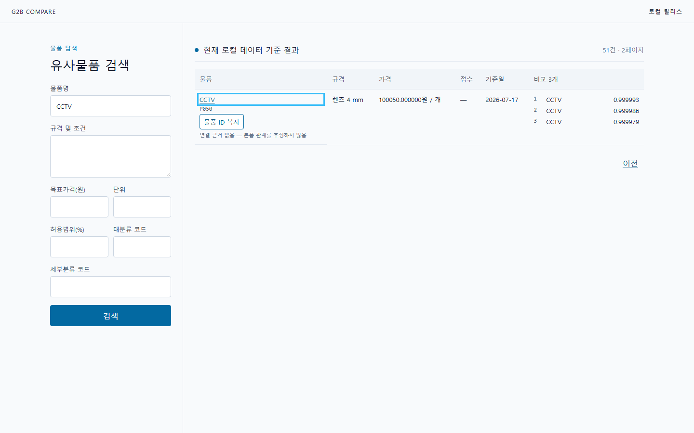
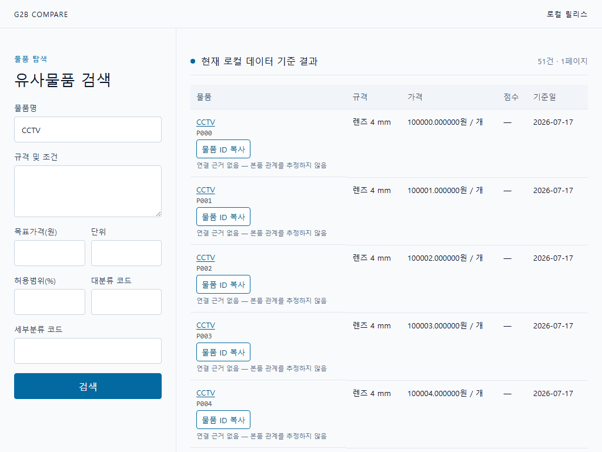
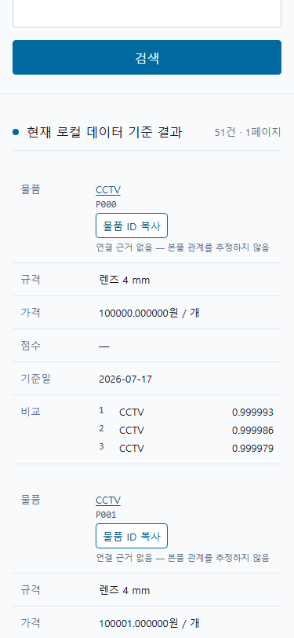

# 나라장터 유사물품 비교 서비스

나라장터 종합쇼핑몰 물품 데이터를 로컬에 수집하고, 물품명·카테고리·규격·가격 조건을 기준으로 유사한 물품과 비교군 3개를 찾는 웹 서비스임. 검색 중에는 외부 API를 호출하지 않아 빠르게 동작하며, 수집 데이터는 중단 지점부터 이어서 갱신할 수 있음.

## 핵심 기능

- 물품명과 규격 텍스트 검색
- 대분류·세부분류 및 목표가격 조건 검색
- 규격과 가격이 비슷한 비교 물품 3개 제시
- 나라장터 공유 링크 또는 물품 ID 복사

화면의 물품 값은 기능 확인용 테스트 데이터임.

## 대표 이미지

## 검색 결과 화면

## 모바일 화면

